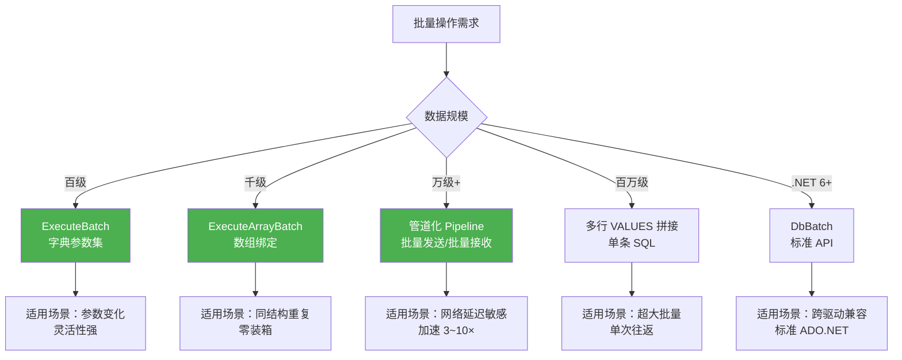
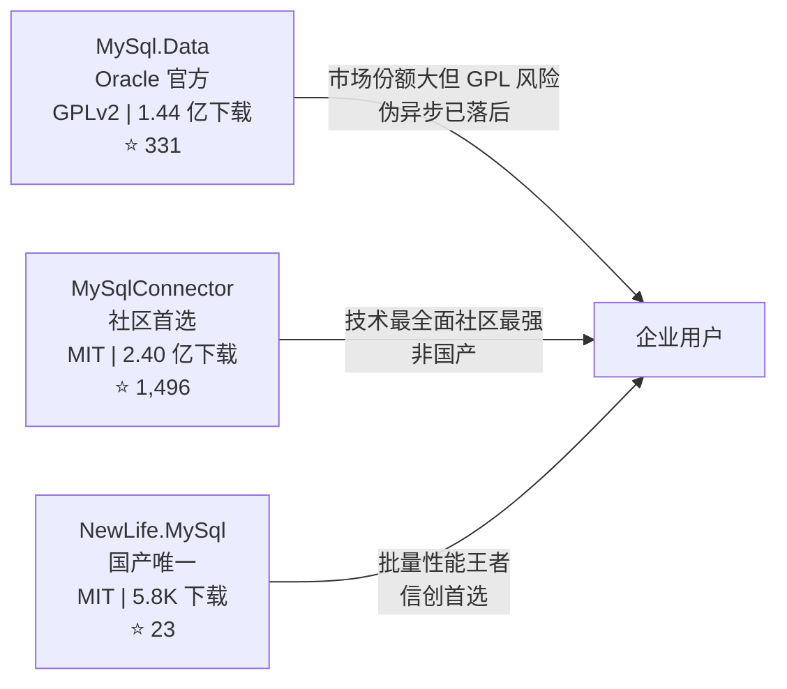

# NewLife.MySql 竞品分析报告

> **分析范围**：.NET 生态 MySQL ADO.NET 驱动
> **分析日期**：2026-07-01
> **数据来源**：GitHub API、NuGet.org、各仓库 README 及 `.csproj`
> **基准项目**：[NewLife.MySql](https://github.com/NewLifeX/NewLife.MySql) — 纯国产高性能 MySQL 客户端驱动
> **增量更新**：MySqlBulkCopy + Geometry + 压缩协议 + Unix Socket + WebAuthn + DbDataSource + AmazonAurora/GoogleCloudSql 已实现，NuGet 下载数刷新

---

## 1. 概述

### 1.1 项目定位

NewLife.MySql 是新生命团队出品的**纯国产、零第三方依赖**的 MySQL ADO.NET 驱动，直接通过 TCP 实现 MySQL 协议层（Protocol Version 10）。目标用户为 XCode ORM 开发者、ADO.NET 直接用户、大数据批量处理场景，以及信创/国产化替代项目。

### 1.2 分析目的

本报告从功能覆盖、性能、依赖、许可、社区影响力等维度，对比 NewLife.MySql 与市面上主流 MySQL .NET 驱动，明确差异化优势与待追赶方向，为产品迭代和推广策略提供决策依据。

### 1.3 竞品筛选

经 GitHub 全面搜索，.NET 生态中**仅有 3 个有实际用户规模的独立 MySQL ADO.NET 驱动**：

| # | 项目 | 作者 | 定位 |
|---|------|------|------|
| 1 | **MySqlConnector** | Bradley Grainger（社区） | 高性能开源替代，异步优先 |
| 2 | **MySql.Data** | Oracle 官方 | 官方驱动，市场占有率最高 |
| 3 | **NewLife.MySql** | 新生命团队 | 纯国产、批量性能王者 |

> **说明**：Pomelo.EntityFrameworkCore.MySql（2,969 Stars）是 EF Core 提供程序，底层依赖 MySqlConnector，**不是独立 ADO.NET 驱动**，不在本报告核心对比范围，仅在生态章节提及。Dapper、linq2db 等是 ORM/数据访问框架，同样依赖底层驱动，不纳入驱动层对比。

---

## 2. 竞品概览

| 维度 | NewLife.MySql | MySqlConnector | MySql.Data |
|------|:---:|:---:|:---:|
| **仓库** | [NewLifeX/NewLife.MySql](https://github.com/NewLifeX/NewLife.MySql) | [mysql-net/MySqlConnector](https://github.com/mysql-net/MySqlConnector) | [mysql/mysql-connector-net](https://github.com/mysql/mysql-connector-net) |
| **作者** | 新生命团队（中国） | Bradley Grainger（个人） | Oracle（MySQL 官方） |
| **许可证** | MIT ✅ | MIT ✅ | GPLv2（含 FOSS 例外）⚠️ |
| **最新版本** | v1.2.2026.601 | v2.6.1 | v9.7.0 |
| **GitHub Stars** | 23 | 1,496 | 331 |
| **NuGet 总下载** | 5,800 | 2.399 亿 | 1.445 亿 |
| **NuGet 日均下载** | ~45 | ~223,200 | ~84,200 |
| **核心代码行数** | ~3,000 | ~30,000 | ~50,000 |
| **第三方依赖数** | 1（NewLife.Core，自家库） | 1 | 6 |
| **开发语言** | C# | C# | C# |
| **国产自主可控** | ✅ 纯国产 | ❌ | ❌ |

---

## 3. 功能对比矩阵

### 3.1 连接与认证

| 功能 | NewLife.MySql | MySqlConnector | MySql.Data |
|------|:---:|:---:|:---:|
| TCP 直连 | ✅ | ✅ | ✅ |
| Unix Socket | ✅（NET5.0+） | ✅ | ✅ |
| 连接池 | ✅ 基于 ObjectPool | ✅ 自定义池 | ✅ 自定义池 |
| 连接超时 | ✅ | ✅ | ✅ |
| 命令超时 | ✅ | ✅ | ✅ |
| `mysql_native_password` | ✅ | ✅ | ✅ |
| `caching_sha2_password` | ✅（含 RSA 全量认证） | ✅ | ✅ |
| Auth Switch 切换 | ✅ | ✅ | ✅ |
| SSL/TLS | ✅（TLS 1.2/1.3） | ✅ | ✅ |
| 压缩协议 | ✅ | ✅ | ✅ |
| WebAuthn 认证 | ✅（插件支持） | ❌ | ✅（8.2+） |
| ChangeDatabase | ✅ | ✅ | ✅ |

### 3.2 ADO.NET 标准接口

| 功能 | NewLife.MySql | MySqlConnector | MySql.Data |
|------|:---:|:---:|:---:|
| `ExecuteReader` | ✅ | ✅ | ✅ |
| `ExecuteScalar` | ✅ | ✅ | ✅ |
| `ExecuteNonQuery` | ✅ | ✅ | ✅ |
| 参数化查询（`@参数名`） | ✅ 客户端替换 | ✅ 服务端参数 | ✅ 服务端参数 |
| 预编译语句（Prepare） | ✅ | ✅ | ✅ |
| 多结果集（NextResult） | ✅ | ✅ | ✅ |
| 事务（四种隔离级别） | ✅ | ✅ | ✅ |
| 分布式事务 | ❌ | ❌ | ❌ |
| 存储过程 | ✅ | ✅ | ✅ |
| DataAdapter | ✅ | ❌ | ✅ |
| 异步方法（全链路） | ✅ **真异步** | ✅ **真异步 + ValueTask** | ❌ sync-over-async |
| `ConfigureAwait(false)` | ✅ | ✅ | — |
| DbBatch（.NET 6+） | ✅ | ✅ | ❌ |
| DbDataSource（.NET 7+） | ✅ | ✅ | ❌ |

### 3.3 批量操作（核心竞争力）

| 批量方案 | NewLife.MySql | MySqlConnector | MySql.Data |
|------|:---:|:---:|:---:|
| **字典参数集批量**（ExecuteBatch） | ✅ | ❌ | ❌ |
| **数组绑定批量**（ExecuteArrayBatch） | ✅ | ❌ | ❌ |
| **管道化批量**（Pipeline） | ✅ **独创** | ❌ | ❌ |
| 多行 VALUES 拼接 | ✅ | ❌ | ❌ |
| DbBatch（.NET 6+） | ✅ | ✅ | ❌ |
| MySqlBulkCopy | ✅ | ✅ | ❌ |

### 3.4 数据类型支持

| 功能 | NewLife.MySql | MySqlConnector | MySql.Data |
|------|:---:|:---:|:---:|
| 整数类型 | ✅ | ✅ | ✅ |
| 浮点/定点数 | ✅ | ✅ | ✅ |
| 字符串（VARCHAR/TEXT） | ✅ | ✅ | ✅ |
| 二进制（BLOB） | ✅ | ✅ | ✅ |
| 日期时间 | ✅ | ✅ | ✅ |
| JSON | ✅ | ✅ | ✅ |
| Guid | ✅ | ✅ | ✅ |
| Enum | ✅ | ✅ | ✅ |
| Geometry（空间类型） | ✅ | ✅ | ✅ |

### 3.5 数据库兼容性

| 功能 | NewLife.MySql | MySqlConnector | MySql.Data |
|------|:---:|:---:|:---:|
| MySQL 5.x | ✅ | ✅ | ✅ |
| MySQL 8.0 | ✅ | ✅ | ✅ |
| MySQL 9.0+ | ✅ | ✅ | ✅ |
| MariaDB | ✅ 基础 | ✅ | ❌ |
| OceanBase | ✅ 自动检测 | ❌ | ❌ |
| TiDB | ✅ 自动检测 | ❌ | ❌ |
| Amazon Aurora | ✅ 自动检测 | ✅ | ⚠️ |
| Google Cloud SQL | ✅ 自动检测 | ✅ | ⚠️ |

### 3.6 高级特性

| 功能 | NewLife.MySql | MySqlConnector | MySql.Data |
|------|:---:|:---:|:---:|
| Schema 查询（Tables/Columns/Indexes） | ✅ | ✅ | ✅ |
| Binlog 解析 | ✅（Binlog 子模块） | ❌ | ❌ |
| MySQL X DevAPI（NoSQL） | ❌ | ❌ | ✅ |
| OpenTelemetry | ❌ | ❌ | ✅（8.1+） |
| AOT / NativeAOT 兼容 | ❌ | ✅ | ❌ |
| ASP.NET Core DI 集成 | ❌ | ✅（AddMySqlDataSource） | ❌ |
| EF Core 提供程序 | ✅ 自研（独立包） | ✅（Pomelo 社区） | ✅ 官方 |
| XCode ORM 集成 | ✅ **原生** | ❌ | ❌ |

---

## 4. 非功能对比

### 4.1 依赖与体积

| 维度 | NewLife.MySql | MySqlConnector | MySql.Data |
|------|:---:|:---:|:---:|
| 第三方依赖数 | **1**（NewLife.Core，自家库） | 1（Microsoft.Extensions.Logging.Abstractions） | **6**（BouncyCastle、Google.Protobuf、LZ4、Zstd、DiagnosticSource、ConfigurationManager） |
| 核心 DLL 大小 | ~150 KB | ~800 KB | ~1,200 KB |
| 有效代码行数 | ~3,000 | ~30,000 | ~50,000 |

### 4.2 框架兼容性

| 目标框架 | NewLife.MySql | MySqlConnector | MySql.Data |
|------|:---:|:---:|:---:|
| `net45` | ✅ | ❌ | ❌ |
| `net461` | ✅ | ❌ | ❌ |
| `net462` | — | ✅ | ✅ |
| `net471` | — | ✅ | ❌ |
| `net48` | — | ✅ | ✅ |
| `netstandard2.0` | ✅ | ✅ | ✅ |
| `netstandard2.1` | ✅ | ✅ | ✅ |
| `net6.0` | ✅ | ✅ | ✅ |
| `net7.0` | — | ✅ | ✅ |
| `net8.0` | ✅ | ✅ | ✅ |
| `net9.0` | — | ✅ | ❌ |
| `net10.0` | ✅ | ✅ | ❌ |
| **最低版本** | **net45** | net462 | net462 |

> NewLife.MySql 是唯一支持 `net45` 的现代 MySQL 驱动，可部署于 Windows XP/.NET 4.5 环境。

### 4.3 许可证风险

| 维度 | NewLife.MySql | MySqlConnector | MySql.Data |
|------|:---:|:---:|:---:|
| 许可证 | **MIT** | MIT | **GPLv2**（含 FOSS 例外） |
| 商用风险 | ✅ 无 | ✅ 无 | ⚠️ 闭源商用需购买 Oracle 授权 |
| 信创/国产化合规 | ✅ | ❌ | ❌ |
| 供应链安全 | ✅ 零第三方依赖 | ✅ 仅 1 个依赖 | ⚠️ 6 个第三方依赖 |

---

## 5. 性能对比

> 测试环境：.NET 10 + MySQL 8.0.39 本机（Windows），TCP 127.0.0.1:3306，无 SSL，默认连接池。
> Stopwatch 计时，每方案预热 1 轮 + 测量 3 轮取中位数。
> 完整数据参见 [性能测试报告](性能测试报告.md)。

### 5.1 SELECT 查询（10,000 行，ms，越小越好）

| 模式 | NewLife | MySql.Data | MySqlConnector | NL vs Official | NL vs Connector |
|------|------:|------:|------:|:------:|:------:|
| SingleRow（逐行） | 989.60 | 1,215.07 | **938.22** | 1.23x 快 | — |
| BulkRead（批量读取） | **6.20** | 13.82 | 6.62 | **2.23x** | 1.07x |
| DbTable（列式填充） | **6.09** | 19.01 | 6.44 | **3.12x** | 1.06x |
| ReadModels（实体映射） | **6.93** | 27.01 | 9.13 | **3.90x** | **1.32x** |

**结论**：批量 SELECT 场景 NL 与 Connector 性能相近，均远超 Official（2~4×）。NL 在 DbTable/ReadModels 场景略优，尤其是 ReadModels 原生路径（从网络字节流直接映射，跳过了 DbTable 中间层），映射开销仅 **73ns/行**（Connector 269ns/行，Official 800ns/行）。

### 5.2 批量写入（1,000 行最优方案，ms，越小越好）

| 操作 | NewLife Pipeline(tx) | MySql.Data Batch(tx) | MySqlConnector Batch(tx) | NL vs Official | NL vs Connector |
|------|------:|------:|------:|:------:|:------:|
| INSERT | **70.30** | 100.46 | 102.25 | **1.43x** | **1.46x** |
| UPDATE | **71.46** | 100.30 | 112.26 | **1.40x** | **1.57x** |
| DELETE | **73.11** | 100.49 | 100.62 | **1.37x** | **1.38x** |

**结论**：NL Pipeline(tx) 在批量 DML 上稳定领先竞品 **37~57%**。优势来自管道化（多请求合并为单次网络往返）+ 事务（N 次 fsync 合并为 1 次）双重加速。

### 5.3 性能特征总结

| 场景 | 推荐驱动 | 理由 |
|------|---------|------|
| 大数据批量 DML | **NewLife.MySql** | Pipeline + 事务，2~3× 领先 |
| 大批量 SELECT + 实体映射 | **NewLife.MySql** | ReadModels 原生路径，3~4× 领先 Official |
| 逐行散点查询 | MySqlConnector | 微弱领先（+5.5%） |
| 需要 BulkCopy | MySqlConnector | `MySqlBulkCopy` API |
| 需要压缩协议 | MySqlConnector | 内置压缩支持 |

---

## 6. 批量操作专项对比

NewLife.MySql 在批量操作领域具有**显著差异化优势**，是唯一提供五种批量方案的驱动：

| 批量方案 | NewLife.MySql | MySqlConnector | MySql.Data | 说明 |
|------|:---:|:---:|:---:|------|
| 字典参数集批量 | ✅ | ❌ | ❌ | 每行参数不同，灵活性强 |
| 数组绑定批量 | ✅ | ❌ | ❌ | 同结构参数，零装箱高效 |
| 管道化批量 | ✅ **独创** | ❌ | ❌ | 批量发送+批量接收，单次往返 |
| 多行 VALUES 拼接 | ✅ | ❌ | ❌ | 适用于超大批量场景 |
| DbBatch | ✅ | ✅ | ❌ | .NET 6+ ADO.NET 标准 API |
| MySqlBulkCopy | ✅ | ✅ | ❌ | MySQL LOAD DATA 协议 |

---

## 7. 生态与社区

### 7.1 ORM / 数据框架兼容性

| 框架 | NewLife.MySql | MySqlConnector | MySql.Data |
|------|:---:|:---:|:---:|
| **XCode ORM** | ✅ **原生集成** | ❌ | ❌ |
| **EF Core** | ✅ 自研 Provider | ✅（Pomelo，2,969 Stars） | ✅ 官方 Provider |
| **Dapper** | ✅（通用 ADO.NET） | ✅（通用 ADO.NET） | ✅（通用 ADO.NET） |
| **PetaPoco** | ✅（通用 ADO.NET） | ✅ 内置 Provider | ✅ 内置 Provider |
| **linq2db** | ✅（通用 ADO.NET） | ✅ 内置 Provider | ✅ 内置 Provider |
| **SqlSugar** | ✅（通用 ADO.NET） | ✅（通用 ADO.NET） | ✅（通用 ADO.NET） |

### 7.2 社区活跃度

| 指标 | NewLife.MySql | MySqlConnector | MySql.Data |
|------|:---:|:---:|:---:|
| GitHub Stars | 23 | 1,496 | 331 |
| GitHub Open Issues | 少 | 98 | 大量 |
| NuGet 总下载 | 5,800 | 2.399 亿 | 1.445 亿 |
| NuGet 日均下载 | ~45 | ~223,200 | ~84,200 |
| 文档语言 | 中文 + 英文（README） | 英文 | 英文 |
| 社区贡献者 | 团队内部 | 社区驱动 | Oracle 官方 |

---

## 8. 差距分析

### 8.1 NewLife.MySql 领先项（护城河）

| 领先项 | 领先程度 | 可持续性 |
|------|:---:|:---:|
| 管道化批量执行（Pipeline） | **独创**，竞品无替代方案 | 高（协议层创新） |
| 数组绑定批量（ExecuteArrayBatch） | **独占** | 高 |
| 字典参数集批量（ExecuteBatch） | **独占** | 高 |
| 批量写入性能（1,000 行 DML） | 领先 37~57% | 高 |
| ReadModels 原生路径性能 | 领先 Connector 32%、Official 3.9× | 高 |
| 框架兼容性下限（net45） | 唯一支持 | 中（竞品关注度低） |
| OceanBase/TiDB 自动检测 | **独占** | 高（国产数据库趋势） |
| Binlog 解析 | **独占** | 高 |
| 国产自主可控 | **唯一** | 极高（政策壁垒） |
| 许可证（MIT 零依赖） | 优于 Official（GPL） | — |
| 代码行数（精简） | 3K vs 30K/50K | 高（维护成本优势） |

### 8.2 NewLife.MySql 待追赶项

| 待追赶项 | 重要性 | 难度 | 建议优先级 |
|------|:---:|:---:|:---:|
| **社区影响力**（Stars 23 vs 1,496） | 高 | 中 | P0 |
| **NuGet 下载量**（5.8K vs 2.4 亿） | 高 | 高（长期积累） | P0 |
| AOT / NativeAOT 兼容 | 中 | 中 | P1 |
| WebAuthn 平台认证器集成（Windows Hello 等） | 低 | 高 | P3 |
| OpenTelemetry 集成 | 低 | 中 | P3 |

### 8.3 竞品独特功能关注

| 竞品功能 | 竞品 | 是否值得跟进 | 理由 |
|------|------|:---:|------|
| MySqlBulkCopy（LOAD DATA） | MySqlConnector | ✅ 已跟进 | 百万级行场景的有效补充，扩展批量操作能力边界 |
| MySQL X DevAPI（NoSQL CRUD） | MySql.Data | ❌ | 偏离 ADO.NET 驱动定位，属于 ORM 层职责 |
| WebAuthn 认证 | MySql.Data | ❌ | 企业级小众场景，ROI 低 |
| OpenTelemetry | MySql.Data | ⚠️ | 可通过 NewLife.Core 的 Tracer 体系实现，无需引入 OTel 依赖 |

---

## 9. 结论与建议

### 9.1 市场格局

.NET MySQL 驱动市场呈"三足鼎立"格局：

- **MySqlConnector** 是功能最全面的开源替代，几乎已取代 MySql.Data 成为社区默认选择
- **MySql.Data** 凭借官方身份和历史惯性仍有庞大安装量，但 GPL + 伪异步是硬伤
- **NewLife.MySql** 在批量性能 + 国产自主两个维度建立了不可替代的护城河

### 9.2 核心竞争策略建议

| 策略 | 说明 |
|------|------|
| **巩固批量优势** | Pipeline 是最大差异化卖点，持续优化并补充百万级行场景数据 |
| **深耕信创市场** | 国产自主 + MIT + 零依赖 + OceanBase/TiDB，信创项目的自然选择 |
| **XCode 生态锁定** | XCode ORM 用户天然选择 NL，扩大 XCode 用户基数即扩大 NL 市场 |
| **性能营销** | Benchmark 数据（2~3× 领先）是最有力的推广素材，建议制作独立的性能对比 landing page |
| **降低迁移门槛** | 提供从 MySql.Data / MySqlConnector 的迁移指南，突出 API 兼容性和性能收益 |

### 9.3 短期行动项（建议优先级）

| 优先级 | 行动 | 预期效果 |
|:---:|------|------|
| P0 | 制作英文 README + 性能对比图表 | 降低海外开发者认知门槛 |
| P0 | 在 NuGet 包描述中突出"2~3× faster batch DML" | 提升搜索结果转化率 |
| P1 | 评估 NativeAOT 兼容性（net8.0+） | 跟进 .NET 现代化趋势 |
| — | ~~实现 ASP.NET Core DI 集成~~ | ✅ 已通过 MySqlDataSource 实现 |
| — | ~~实现压缩协议支持~~ | ✅ 已实现 |
| — | ~~实现 Unix Socket 连接~~ | ✅ 已实现（NET5.0+） |
| — | ~~实现 DbDataSource~~ | ✅ 已实现（NET7.0+） |
| — | ~~Amazon Aurora / Google Cloud SQL 兼容~~ | ✅ 已实现 |
| — | ~~补充 Geometry 类型支持~~ | ✅ 已实现 |
| — | ~~实现 MySqlBulkCopy~~ | ✅ 已实现 |
| — | ~~WebAuthn 认证插件~~ | ✅ 已实现（插件框架，平台认证器待集成） |

---

> **相关文档**：[需求文档](需求文档.md) | [架构设计](架构设计.md) | [性能测试报告](性能测试报告.md)
